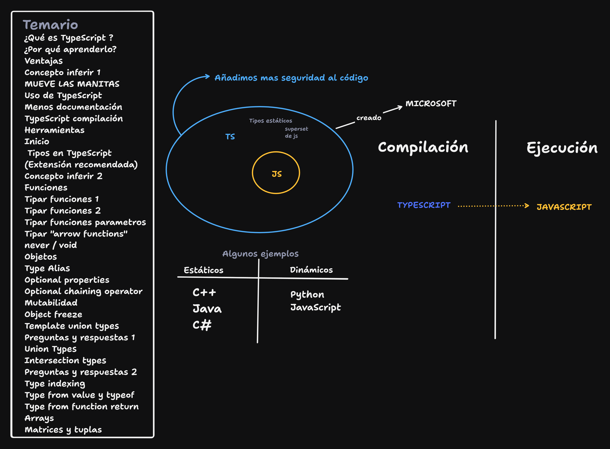

# 🚀 Curso - Clase de TypeScript

### 📌 Temario: 
</img>

## 🧞 Comandos

|     | Comando          | Acción                                        |
| :-- | :--------------- | :-------------------------------------------- |
| ⚙️  | nodemon <archivo.ts> start --watch |  vizualizar logs y demas en tiempo real   |
